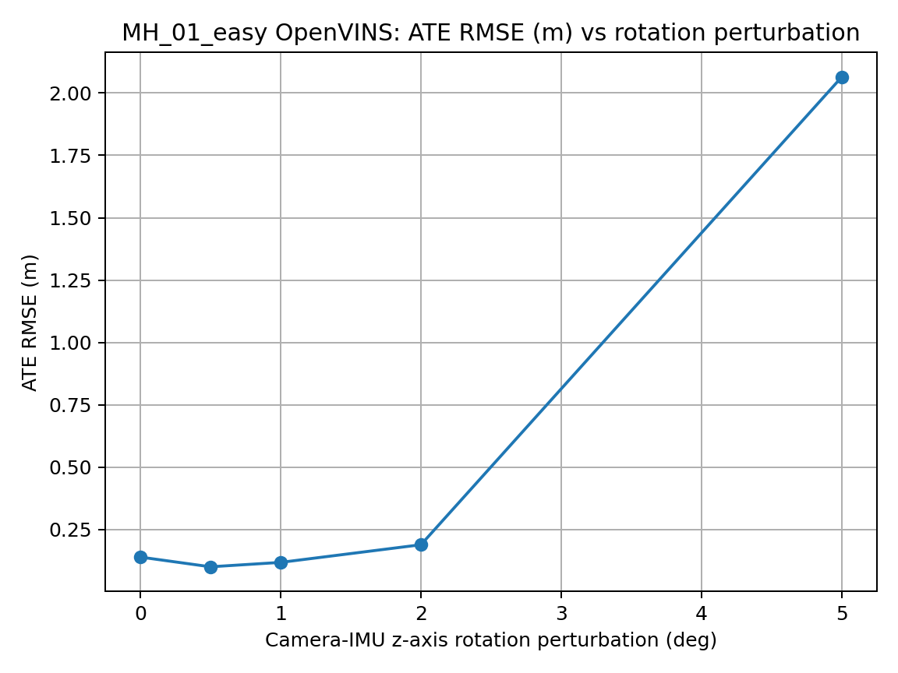
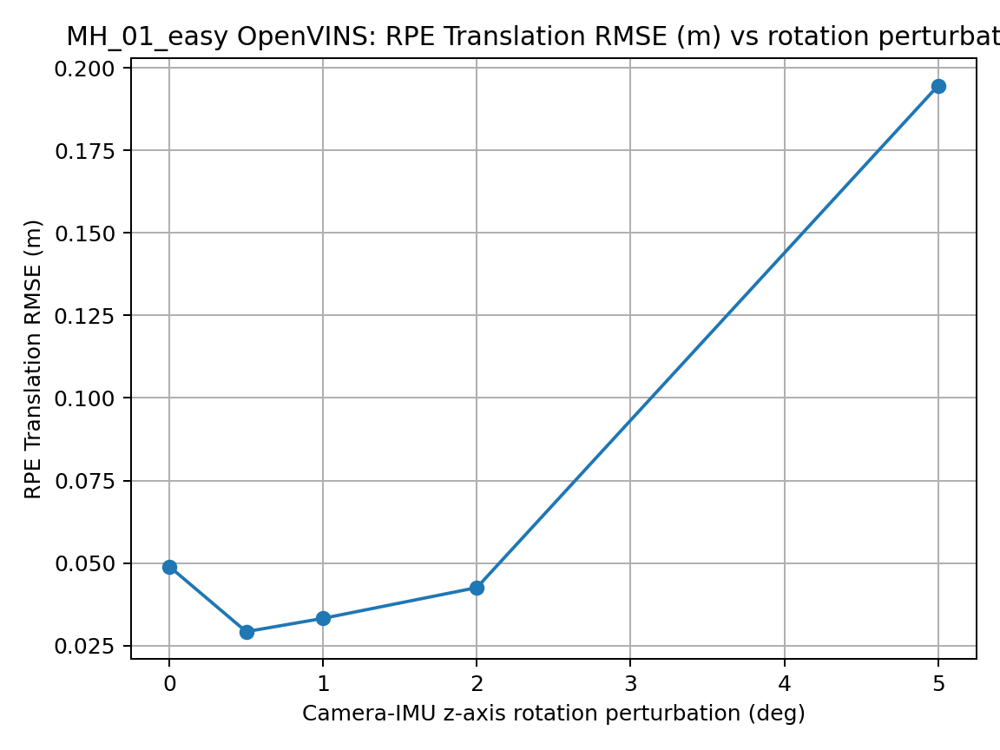
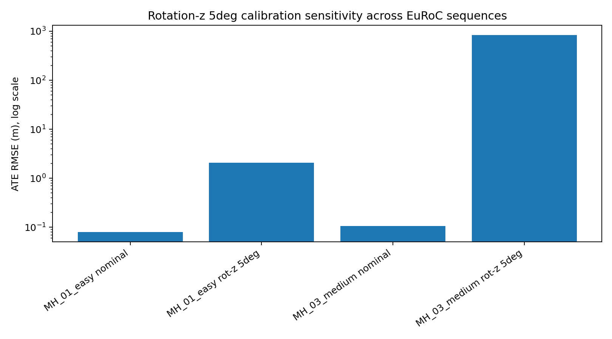
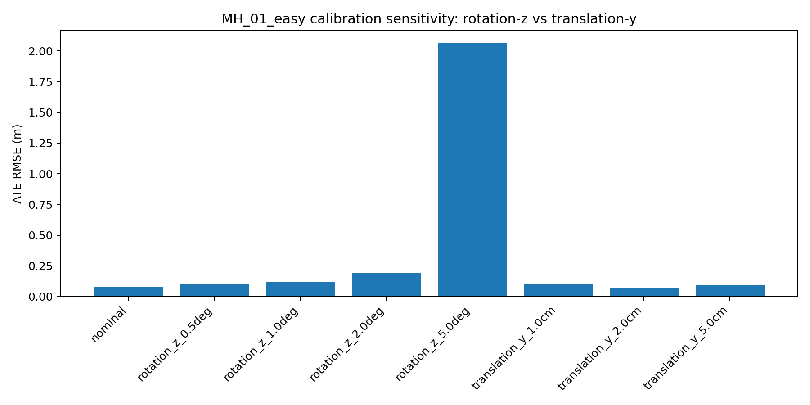
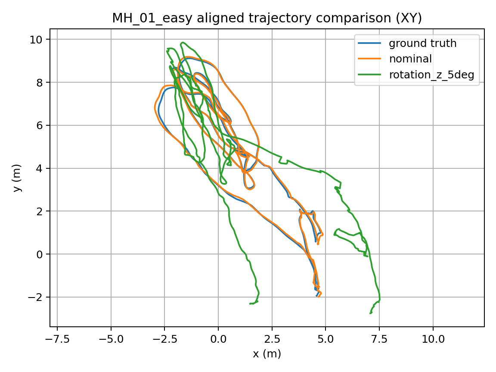
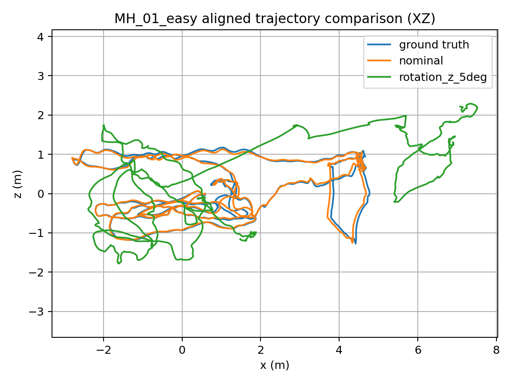

# Camera-IMU Calibration Sensitivity Benchmark

A reproducible benchmark for measuring how camera-IMU calibration error affects visual-inertial odometry accuracy.

This project injects controlled camera-IMU extrinsic perturbations into OpenVINS EuRoC MAV configurations, runs VIO on ROS 2 bags, evaluates trajectories against ground truth with evo, and summarizes the degradation in ATE/RPE metrics.

## Why this matters

Visual-inertial odometry depends heavily on accurate camera-IMU calibration. Small calibration errors can be tolerated, but larger errors can cause drift, unstable trajectories, or failure-like behavior.

This repository turns that into a measurable experiment:

```text
nominal config
  -> perturb camera-IMU calibration
  -> freeze online calibration
  -> run OpenVINS
  -> convert trajectory
  -> evaluate with evo
  -> collect metrics and plots
```

## Current benchmark

| Item | Value |
|---|---|
| Datasets | EuRoC MAV `MH_01_easy`, `MH_03_medium` |
| Estimator | OpenVINS |
| Evaluation | evo ATE/RPE |
| Alignment | SE(3), no scale correction |
| Perturbations | camera-IMU z-axis rotation; camera-IMU y-axis translation |
| Rotation magnitudes | 0, 0.5, 1, 2, 5 degrees |
| Translation magnitudes | 1, 2, 5 cm |
| Calibration policy | camera extrinsics, intrinsics, and camera-IMU time offset frozen |

## Key result

A 5 degree camera-IMU z-axis rotation perturbation increased ATE RMSE from `0.139204 m` to `2.064969 m` on `MH_01_easy`, a `14.83x` increase. On `MH_03_medium`, the same perturbation increased ATE RMSE from `0.107259 m` to `831.507723 m`, a `7752.34x` increase. In contrast, tested y-axis translation perturbations from 1 to 5 cm stayed near nominal ATE on `MH_01_easy`.

| Rotation z perturbation | ATE RMSE (m) | RPE trans RMSE (m) | RPE rot RMSE (deg) |
|---:|---:|---:|---:|
| 0.0 deg | 0.139204 | 0.048954 | 0.268658 |
| 0.5 deg | 0.100281 | 0.029226 | 0.229276 |
| 1.0 deg | 0.117957 | 0.033253 | 0.260834 |
| 2.0 deg | 0.188732 | 0.042565 | 0.237368 |
| 5.0 deg | 2.064969 | 0.194584 | 0.343487 |


Multi-sequence rotation-z 5 degree result:

| Sequence | Nominal ATE RMSE (m) | Rotation-z 5deg ATE RMSE (m) | Increase |
|---|---:|---:|---:|
| MH_01_easy | 0.139204 | 2.064969 | 14.83x |
| MH_03_medium | 0.107259 | 831.507723 | 7752.34x |

Translation-y results:

| Translation y perturbation | ATE RMSE (m) | RPE trans RMSE (m) | RPE rot RMSE (deg) |
|---:|---:|---:|---:|
| 1.0 cm | 0.100477 | 0.003801 | 0.047589 |
| 2.0 cm | 0.073369 | 0.002520 | 0.040947 |
| 5.0 cm | 0.095484 | 0.003577 | 0.042328 |

Small perturbations from 0.5 to 2 degrees remain close to nominal on this sequence. The 5 degree perturbation shows a clear accuracy collapse. Small perturbations appearing slightly better than nominal should not be interpreted as improved calibration; they may reflect estimator variance, alignment effects, or model mismatch.

## Visual results

### ATE degradation



### RPE translation degradation



### Multi-sequence rotation-z 5 degree sensitivity



### Rotation-vs-translation error budget



### Aligned trajectory comparison

Ground truth, nominal OpenVINS, and 5 degree perturbation are time-associated and SE(3)-aligned before plotting.





Additional plot:

- `results/plots/mh01_rotation_z_rpe_rot_rmse.png`

## Repository layout

```text
configs/       Nominal and generated OpenVINS configs
docs/          Setup, architecture, runtime, and limitation notes
environment/   Python environment and container notes
reports/       Result summaries and benchmark reports
results/       Metrics, plots, trajectory outputs, evo summaries, and logs
scripts/       Dataset conversion, perturbation generation, run prep, evaluation, plotting
src/           Python modules for perturbation and metrics schema logic
tests/         Regression tests for schema, perturbation, config generation, and plotting
```

## Reproduce

This repository assumes:

```text
EuRoC ROS 2 bags:   ~/datasets/euroc/ros2_bags/MH_01_easy and ~/datasets/euroc/ros2_bags/MH_03_medium
OpenVINS workspace: ~/openvins_ws_jazzy
```

Run tests:

```bash
source .venv/bin/activate
./scripts/run_tests.sh
```

Generate rotation sweep configs:

```bash
python scripts/generate_rotation_sweep_configs.py --sequence MH_01_easy --axis z --magnitudes-deg 0.5 1.0 2.0 5.0
```

Prepare a run-specific OpenVINS config:

```bash
python scripts/prepare_openvins_run_config.py --run-id openvins_MH01_rot_z_2deg_full_000 --source-config-dir configs/generated/openvins/MH_01_easy/rotation_z_2deg --sequence MH_01_easy --perturb-type rotation --perturb-axis z --perturb-magnitude 2.0 --perturb-units deg
```

Run OpenVINS in one terminal:

```bash
bash scripts/run_openvins_prepared_run_generic.sh openvins_MH01_rot_z_2deg_full_000 perturbed
```

Play the EuRoC ROS 2 bag in another terminal:

```bash
bash scripts/play_euroc_full_bag.sh MH_01_easy openvins_MH01_rot_z_2deg_full_000 perturbed
```

Convert OpenVINS output to TUM format:

```bash
python scripts/convert_openvins_state_to_tum.py --input results/trajectories/perturbed/openvins_MH01_rot_z_2deg_full_000/ov_estimate.txt --output results/trajectories/perturbed/openvins_MH01_rot_z_2deg_full_000/openvins_estimate.tum
```

Evaluate with evo:

```bash
evo_ape tum results/trajectories/groundtruth/MH_01_easy_gt.tum results/trajectories/perturbed/openvins_MH01_rot_z_2deg_full_000/openvins_estimate.tum -a --t_max_diff 0.01
```

## Primary artifacts

| Artifact | Path |
|---|---|
| Metrics table | `results/metrics.csv` |
| Rotation sweep table | `results/tables/mh01_rotation_z_sweep.csv` |
| Rotation sweep report | `reports/mh01_rotation_z_sweep.md` |
| Trajectory visualization report | `reports/mh01_trajectory_visualization.md` |
| ATE plot | `results/plots/mh01_rotation_z_ate_rmse.png` |
| Rotation-vs-translation plot | `results/plots/mh01_rotation_vs_translation_ate_rmse.png` |
| Multi-sequence rotation plot | `results/plots/mh01_mh03_rotation_z_5deg_ate_rmse.png` |
| Error-budget table | `results/tables/mh01_rotation_vs_translation_error_budget.csv` |
| Multi-sequence table | `results/tables/mh01_mh03_rotation_z_5deg_summary.csv` |
| Error-budget report | `reports/mh01_rotation_vs_translation_error_budget.md` |
| Multi-sequence report | `reports/mh01_mh03_rotation_z_5deg_summary.md` |
| Trajectory overlay | `results/plots/mh01_gt_nominal_rot5_aligned_xy.png` |

## Tests

The Python test suite covers:

- metrics schema validation
- camera-IMU transform perturbation math
- OpenVINS calibration flag freezing
- generated sweep config labels
- run-specific config preparation
- trajectory time association and SE(3) alignment helpers

Run:

```bash
./scripts/run_tests.sh
```

## Limitations

- Full rotation and translation sweeps are currently reported for `MH_01_easy`; `MH_03_medium` currently has nominal and rotation-z 5 degree results.
- Current reported perturbations cover z-axis camera-IMU rotation and y-axis camera-IMU translation only.
- Results should not be generalized to all axes, all trajectories, or all VIO systems.
- Timestamp perturbation is planned but not reported here.
- Recovery experiments are not claimed in the current result.
- Small perturbations appearing better than nominal should not be interpreted as improved calibration.

## Planned extensions

- x/y/z translation-axis comparison
- broader MH_03_medium perturbation sweep
- x/y/z rotation-axis comparison
- error-budget summary comparing rotation and translation sensitivity
- optional timestamp offset perturbation
